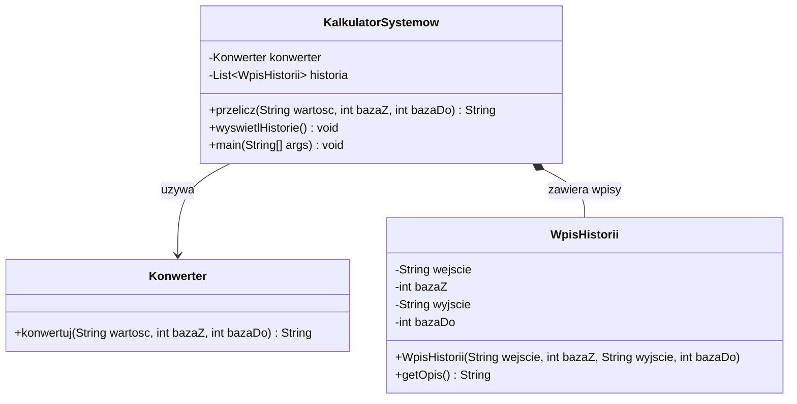

# Diagram klas UML

```mermaid

classDiagram
    class Konwerter {
        +konwertuj(String wartosc, int bazaZ, int bazaDo) String
    }

    class WpisHistorii {
        -String wejscie
        -int bazaZ
        -String wyjscie
        -int bazaDo
        +WpisHistorii(String wejscie, int bazaZ, String wyjscie, int bazaDo)
        +getOpis() String
    }

    class KalkulatorSystemow {
        -Konwerter konwerter
        -List~WpisHistorii~ historia
        +przelicz(String wartosc, int bazaZ, int bazaDo) String
        +wyswietlHistorie() void
        +main(String[] args) void
    }

    KalkulatorSystemow --> Konwerter : uzywa
    KalkulatorSystemow *-- WpisHistorii : zawiera wpisy
```